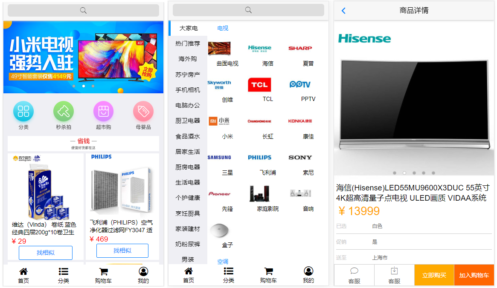
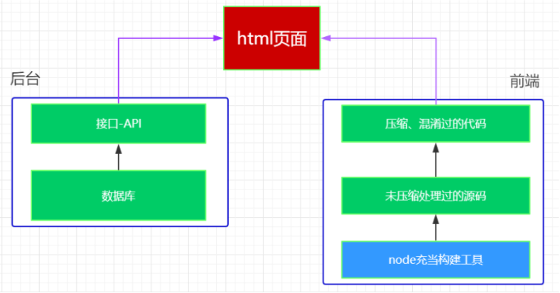

# 项目介绍

## 项目背景

​	品优购网上商城是一个综合性的 B2B2C 平台，类似京东商城、天猫商城。网站采用商家入驻的模式，商家入驻平台提交申请，有平台进行资质审核，审核通过后，商家拥有独立的管理后台录入商品信息。商品经过平台审核后即可发布。

​	品优购网上商城主要分为网站前台、运营商后台、商家管理后台三个子系统

### 网站前台



## 架构介绍		

​	目前企业中开发的项目，大部分是使用 **前后端分离** 的架构。如图 



# 技术在线

​	可能需要用得到的网站

| 名称         | 网址                                          | 备注               |
| ------------ | --------------------------------------------- | ------------------ |
| zepto        | http://www.css88.com/doc/zeptojs_api/         | zepto的中文api     |
| art-template | http://aui.github.io/art-template/zh-cn/docs/ | 模版引擎           |
| fontawesome  | http://fontawesome.dashgame.com/              | 字体图标           |
| mui官网      | http://dev.dcloud.net.cn/mui/                 | 官方网站           |
| hello-mui    | http://www.dcloud.io/hellomui/                | 在线案例           |
| mui-辅助类   | http://www.mubrand.com/?post=19               | mui的辅助类        |
| 品优购在线   | http://pyg.ak48.xyz/                          | 上课参照的案例     |
| 上课源代码   | https://gitee.com/ukSir/gz20-pyg.git          | 上课的源代码的地址 |
| api接口文档  | [api.md](api.md)                              |                    |


# 关键代码

## mui轮播图

​	轮播图如果是动态生成,则需要在渲染完毕之后,手动执行初始化.

### HTML

```html
<div class="mui-slider">
  <div class="mui-slider-group mui-slider-loop">
    <!--支持循环，需要重复图片节点-->
    <div class="mui-slider-item mui-slider-item-duplicate"><a href="#"></a></div>
    <div class="mui-slider-item"><a href="#"></a></div>
    <div class="mui-slider-item"><a href="#"></a></div>
    <div class="mui-slider-item"><a href="#"></a></div>
    <div class="mui-slider-item"><a href="#"></a></div>
    <!--支持循环，需要重复图片节点-->
    <div class="mui-slider-item mui-slider-item-duplicate"><a href="#"></a></div>
  </div>
</div>
```

### javascript

```javascript
//获得slider插件对象
var gallery = mui('.mui-slider');
gallery.slider({
  interval:5000//自动轮播周期，若为0则不自动播放，默认为0；
});
```

# 页面分析

## 首页